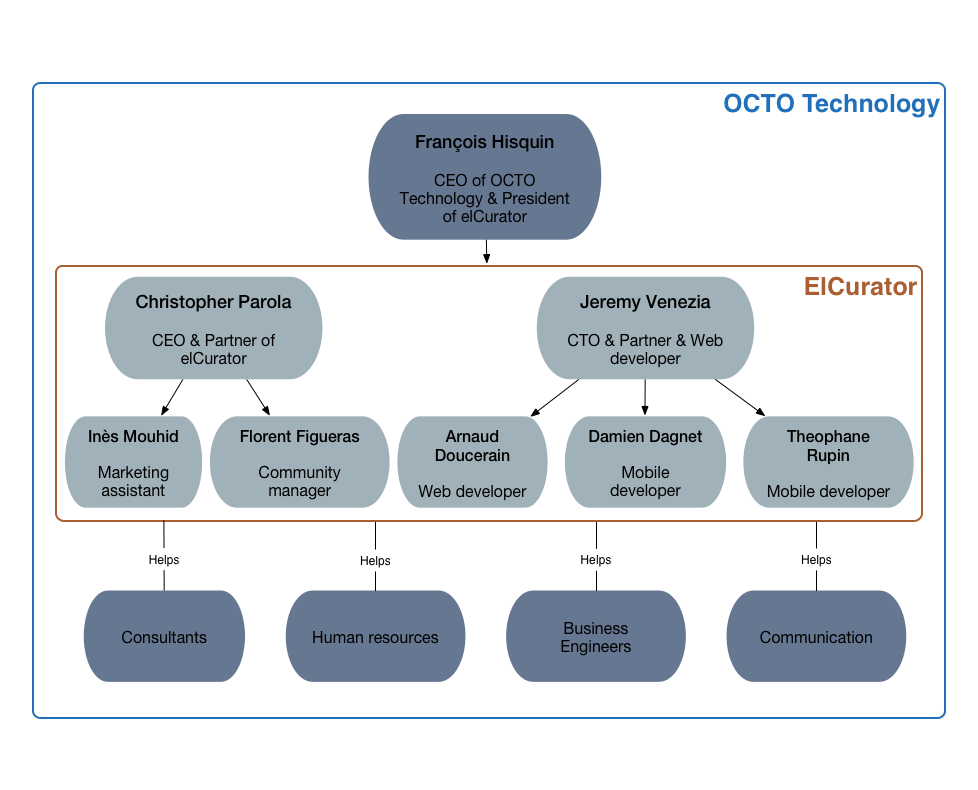
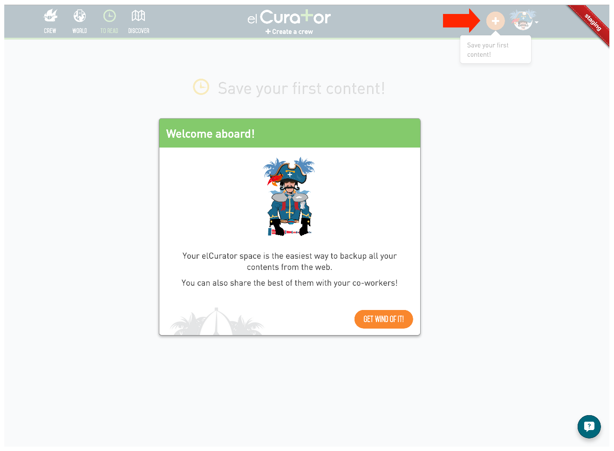
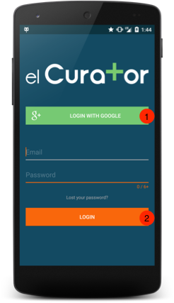

#ElCurator - The developer's beginning guide

Just like software, this document will rot unless we take care of it. We encourage you to help us on that by giving us your feedbacks.

## What is this document for?

If you are reading this, you probably just arrived in the elCurator's developers team. First of all, welcome, and congratulation.

Because we are aware there is a lot of informations to absorb during your first days, we try to keep this document up to date in order to give you a point of reference concerning our team, our product and our methodologies. You also will get a good idea of what we think a good developer is.

This document is obviously targeting the developers, but we put all our efforts to make it understandable by everybody. If you are curious about what we are doing at elCurator, and even if you are not a developer, this document should still be interesting, and we hope it will statisfy your curiosity.

## A startup inside OCTO Technology

It is actually quite complex to explain what is our working environment. What is OCTO Technology and is it related to us? Are we an independant company or not? Who is investing in us? We will try to clarify these points in this chapter.

### What is OCTO Technology?

First of all, we should explain what is exactly **OCTO Technology**. You can find all the informations you need about this company on its [website](http://www.octo.com/en/who-we-are). Even though, we define OCTO Technology as an **IT consulting, design and implementation company**. Founded in 1998, OCTO is now employing 230 people in 5 coutries: France, Brazil, Switzerland, Morocco and Autralia. The OCTO community is mainly made up of IT consultants, and the main activity of OCTO is to guide and help realize its clients' projects.

There is a way of doing things at OCTO which pushes its employees to think about innovative concepts and develop them from inside the company. **That's how two products were born in the company**:

- [Appaloosa](https://www.appaloosa-store.com/?locale=en) which is a private mobile application store.
- [elCurator](https://www.elcurator.net/en) which is a collaborative curation platform, but we will explain what it is in the next parts of this document.

### From the one day hacking project, to the affiliated company

ElCurator is a product which was **initiated by two consultants of OCTO Technology** in 2012 during a particular day called the OCTO day. This event is happening once a year, and is aimed to let every employees work on whatever they want, as long as it is useful to the company.

That day, **Christopher Parola** - now CEO of the company - started the project with several workmates, and in one day of work, they tried to make a prototype. This was a failure since it wasn't working as expected, and Christopher continued to work on it on his free time. **Jeremy Venezia** - now CTO of the company - joined him several weeks after that, and helped him in his task. The product began to work, and a few consultants at OCTO started using it. With time, more and more people were using it, and Christopher and Jeremy decided to **deploy it to the whole company**. Maintaining the project was taking to much time, and the two consultants asked to be full-time working on it. That's how elCurator began to live, as a project funded by OCTO Technology. In June 2014, the project has been **publicly released** and OCTO Technology started to communicate on it in order to sell it to other companies (mainly to its own clients). In January 2015, the project has been **affiliated**, and it became a company named **elCurator SAS**.

### Are we a startup?

A startup is an entrepreneurial venture or a new business in the form of a company, a partnership or temporary organization designed to search for a repeatable and scalable business model.

This correspond pretty well to our situation since we are still searching our place on the market by trying to reach as much clients as possible.

### Are we an intrapreneurship?

Intrapreneurship is the act of behaving like an entrepreneur while working within a large organization.

We can say we are an intrapreneurship as well, since elCurator has been created and directed by two OCTO consultants from its begining.

### And Juridically?

To juridically, we are a **simplified limited liability company**, which is what *SAS* is actually meaning in french. We are an **affiliate** of OCTO Technology as well, since it owns more than 50% of the our capital.

### Our legacy

As we just said, elCurator started living inside OCTO Technology. Its creators are two former consultants. We are all the time in relationship with other consultants of the company. This is actually a good thing since OCTO has a very resourceful community made up of experts on many topics (the [OCTO blog](http://blog.octo.com/) demonstrates it pretty well). This is obviously influencing our way of working together, our methologies, etc... It is a very resourceful legacy to us.

## Our team

With time, we developed three main activities around our product:

- Software developement
- Communication / Community management
- Sales

Since we are an affiliate of OCTO Technology, we beneficiate of some extra services as:

- Consulting on IT topics
- Human resources
- Business engineering
- Communication

This extra help is very important because it provides us some kinds of frameworks on which we can rely when we don't have the necessary skills. For example, when Christopher had to write a contract from scratch for our first client, he has been able to get some help by OCTO. We also get some help when we need to hire new people. Wand we could tell more examples...

## The product

We talked about the company's situation, but we haven't explained the activity of elCurator. What are we actually doing here? As you must have understood, elCurator SAS is a software company developping and selling a product named elCurator. In this chapter, you will find the informations you need about the product to easily understand and start manipulating it. We think each members of our team should be capable of explaining the product, and talking about it outside our walls.

### The concept

ElCurator is a **collaborative [curation](https://en.wikipedia.org/wiki/Digital_curation) platform**. In other words, our mission is to encourage workmates to share high quality contents in their company, and highlight the best shared contents.

The concept is defined by 3 main steps:

1. **Select** the best contents.
2. **Add** a short description to justify why the content is relevant.
3. **Share** it to a community.

### Why our clients need us?

Since June 2014, when we publicly launched our product, we started recognizing our clients. Obviously, we are targetting medium and large businesses. Our strategy is mainly a B2B (business to business) strategy. Some functionalities are B2C (business to client) oriented, but the goal is always to be more relevant to large companies by being more famous on the market.

So far we identified that our product is a good fit for medium digital and consulting agencies, education organizations, and large banks. For each kind of client, we noticed several needs that we are able to fit:

* **Stop infobesity**. It is nowadays a fact that we receive too many informations by mail at work. If your workmates are sending you their curated content by mail, there are good chances that you ignore it because you have plenty of more important mails to treat. We believe there should be a time for treating mails, and a time for curation in a work day, and that's exactly what elCurator permits to do.
* **Identify and highlight experts**. It can be difficult for managers to see who is expert on what topic. Thanks to elCurator, it is very easy to identify them by checking what they are sharing.
* **Collective knowledge capitalization**. The content of the company is saved by the our platform. ElCurator
* **Continuous formation**. Every workmates can easily reach expert contents and quickly start developing new skills.

### The main features

If you need to work on elCurator, you need to know what are the main features, so you realize what are the main use cases of our product.

Elcurator is made of several tools:

- A **website**, which is the most used platform by our users so far.
- Two **mobile applications**; Android and iOS.

#### User story: the web platform

Because features list wouldn't be very attractive to read, let's tell a user story.

Manu is a project manager. He knows its workmates are read plenty of articles on the we every day, but keep it for them. He is desperate because his team as a pretty high turnover, and each time someone is leaving, he knows that all his expertise is leaving with him.

Manu needs a solution. He needs to convince his workmates to share their knowledge alltogether. Most of all, he needs to store this knowledge, so the new recruits can take advantage of it when they arrive in the team.

Searching on the web, Manu types *best curation tool* on Google, and come to the elCurator landing page. It's said it's free for one organization made of less than 20 users. Eureka! Manu clicks on the *'create an account'*.

##### Create an account

There are 3 ways to of openning an account:

1. Using an existing Google account.
2. Using an existing Yammer account.
3. By filling a form.

Manu choose to create an account with Google.

##### First content

Manu then click on the *+* button to add his first content on the plateform.

On this form, Manu needs to:

1. Put the url of the content he wants to share.
2. Click on the *read later* button to validate and add its articles into the *to read list*

##### The to read list

The *to read list* is a place where Manu can store his personal articles.

From here, he can:

1. See how many articles he has left to read.
2. Click on an article card to read it.
3. Delete an article from the list. It could be not good enough after all.
4. Tag an article.
5. When he will have too many articles in the list, he will be able to search into its article contents.

This list is designed to be like a todo list. The goal is to read the articles Manu put into it, then trash it, or classify it.

##### The reading page

Manu wants to read his article. He clicks on the card, and here is what he sees.

On this page, he find the article content. Notice that elCurator applied his own design to improve the readability.

He also can:

1. Customize the font class and size.
2. Share his content by email, or on Twitter, Google+, Pocket, etc...

##### Create a crew

Manu can easily store and consult his personal articles, but now he would like to know how he will convince his workmates to share their knowledge through elCurator.

No worries, we are coming to it!

To be able to share content on the platform, Manu needs to invite his workmates. But to what? 
Manu finds the *create a crew* button just below the elCurator's logo in the navigation bar.
What we call a crew is actually a group of collaborators. Manu creates a crew named *Eldorado*. He is now **administrator** of his own crew.

Right after creating his crew, he is redirected to the page below.

Here he discovers what he can do with his crew:

1. Create **categories**. Remember that we want to be able to easily find relevant contents shared by people who won't necessary tag their content the same way. That's why we force the administrator to create categories in order to oblige his crew members to follow an editorial policy.
2. Share an article with his crew members.
3. Invite his workmates to do the same.

##### Share an article to a crew

Manu creates several categories and comes back to his article to read. Now he has created a crew, he can click on the *share* button to share his article to the *Eldorado* crew. Notice he could have done the same by clicking on the *+* button on the right of the navbar.

Manu has to fill several fields:

1. The article title.
2. The article description.
3. The article category.
4. Finally he can choose to ask to elCurator to extract the content as a text, or to take a screenshot of the webpage. The screendshot it usually used when you want to share a graphical content which can't be extracted.

##### Improve the article's visibility

After having shared his article, Manu is redirected to the shared article page, where he finds the readable content plus an optional form to fill in order to improve the visibility of the arricle on the platform.

Here he can:

1. Add tags.
2. Recommend it to a member of his crew.
3. Share it to what we call the *world*. It is a public list of articles. When this option is enabled, the article is still shared to the Manu's crew, but it's also visible in the *world list* by to all the elCurator's users.
4. Share it by email, Twitter, Google+, etc...

##### The crew's list

Manu then click on the *back* button in the navigation bar and is goes to its crew's list.

This page is one of the most important of the application. Here he can find back the article he just shared to his crew. On this page, Manu notices few things:

1. The rate count. When the members of his crew are going to read the article, they will be able to give it a point if they liked it. The number of *likes* is shown here. When the flag is green, it means the current user can rate the article, but when it's grey, it means the he is the sharing's author, which means he cannot give a point to himself.
2. The category. As we said, every article must be categorized. The article's category is shown here. Each categories has a specific color.
3. The *read later* button permits to the members of Manu's crew to put it in their *to read list*. We think our users have rarely the time to read immediately the content of an article. The to *read later* button is here to encourage them not to forget it, and read it later.
4. A new kind of card which represents his rank among his crew's users. This rank is calculated with the number of rates and readers he had so far.
5. The *search bar* on which he finds a way to filter by category and keywords. He can also hide or show the read articles. And he can order the list by date, read count or popularity.
6. Manu is also using another tool to read his news feeds. He can do it by clicking on the *RSS* button which is a representation of the list using the RSS format. That way, Manu can import all his crew's content in his favorite RSS reader tool.

##### The world's list

Manu invited his workmates to his crew, but waiting for us to share some content, he wants to discover what the world is doing on elCurator.

He clicks on the *world* button in the navigation bar.

This list is the same as the crew's list except it only contains the publicly shared articles, and there is a way of filtering by tags instead of categories.

#### User story: the mobile applications

######Note: we wont describe here the iOS's features since they are equivalent as what is implemented on Android.

##### Installation

Now that Manu knows how to use the platform, we wonders; what if I want to be notified on my mobile when I receive an article? and what if I want to read some content in the subway?

Since he has an Android phone, he goes to the Play Store and search for elCurator.

He installs the elCurator's application on his smartphone.

##### Login

When launching the application for the first time, Manu get the login page.

Just like on the website, Manu can login using:

1. His Google account.
2. His regular credentials.

##### Navigation

Manu logs in the application via his Google account and arrives on the *to read* list. He finds almost the same graphics elements than on the website.

Has we can see above, the application permits him to navigate to the *world list*, the *to read list* and his *crew's list*. 

##### Add an article

Manu his now leaving his workplace. He starts reading an article on his phone in the elevator, but doesn't have much time to finish. He can put his article in his *to read list* like below.

###### Note: Manu could also have used the *+* floating button in the application to access the same form. He also could have chosen to share to his crew instead.

##### Offline access

Manu is now in the subway. He wants to continue to read his article in elCurator. Since all the content shown in the application is immediately accessible offline, he can continue find back his article in his *to read list* and continue to read without even noticing he lost his network access.

###### Note: almost every features are also accessible offline in the mobile application.

#### User story: the end

Manu is now an happy manager since he has setup an engaging sharing policy in his workteam. His workmates are now able to share their knowledge alltogether, and Manu can even see the statistics of his crew in order to measure if elCurator is efficient or not.

## Our methodologies

Developing a product with many use cases like elCurator isn't an easy task. We need to be focused on development quality, client support, our marketing image, finding clients, etc.

There are many topics to study, many metrics to observe, many skills to have, and we would be lost in less than a week if we weren't applying few methodologies.

In this chapter, you will learn our way of getting things done at elCurator.

### Lean startup

The lean startup is a method for developing businesses and products developped by Eric Ries in 
2008, based on his experience in IT companies of the Silicon Valley.

#### How we do it

At elCurator, we are trying to apply the following terminologies as much as possible:

- **Minimum viable product**. It is the version of a new product which allows a team to collect the maximum amount of validated learning about customers with the least effort. ElCurator actually began by a MVP which as been then improved step by step.
 
- **Continuous deployment**. It is a process whereby all code that is written for an application is immediately deployed into production. We are using specifics workflows and tools in order to be able to continuously deploy the code. This will be described later in this document.

- **Actionable metrics**. These are metrics specifically put by our developers in the code. For example, a metric to know how many times our users clicked on a button which gives access to a specific feature. Day by day, we can then follow these kind of metrics to observe how our product is really used.
 
- **Build-Measure-Learn**. It is a learning cycle of turning ideas into products, measuring customers' reactions and behaviors against built products, and then deciding whether to persevere or pivot the idea; this process repeats as many times as necessary.

#### Why do we need to be lean?

We are a little team. We don't have many resources. We work on a high risk product, since we still don't know if we will be able to make monney with it. For all these reasons, we need to learn from our users to find our place on the market. We are convinced lean startup is a very efficient methodology to do it.

### Agilility

Agile software development is a group of software development methods in which solutions evolve through collaboration between self-organizing,[1] cross-functional teams. It promotes adaptive planning, evolutionary development, early delivery, continuous improvement, and encourages rapid and flexible response to change.

#### How we do it

At elCurator, we are trying to apply the following principles as much as possible:

- **Iterative**, **incremental** and **evolutionary** planning. To apply this, we use a virutal *Kanban*.

- Efficient and **face-to-face communication**. This is what we call the *stand up*. Every morning at 10am, all the team stand up and each teammate tells what he did yersterday and what he is going to do today.

- Very **short feedback loop** and adaptation cycle.

- **Quality** focus. At elCurator, we believe that quality code means a quality product. All the code our developers are writing is reviewed by at least one different developer. If the code quality is not good enough, the task isn't considered as done.

#### Why do we need to be agile?

Almost for same reasons as we need to be lean. We need flexibility because we don't know our market very well yet. We need to adapt very quickly to our clients demands.

### Development workflow

#### Trello, our virtual Kanban

Kanban is a system to control the logistical chain from a production point of view, and is an inventory control system. Kanban was developed by Taiichi Ohno, an industrial engineer at Toyota, as a system to improve and maintain a high level of production.

For practical reasons, we are using a virtual Kaban thanks to a tool called [Trello](https://trello.com/).

